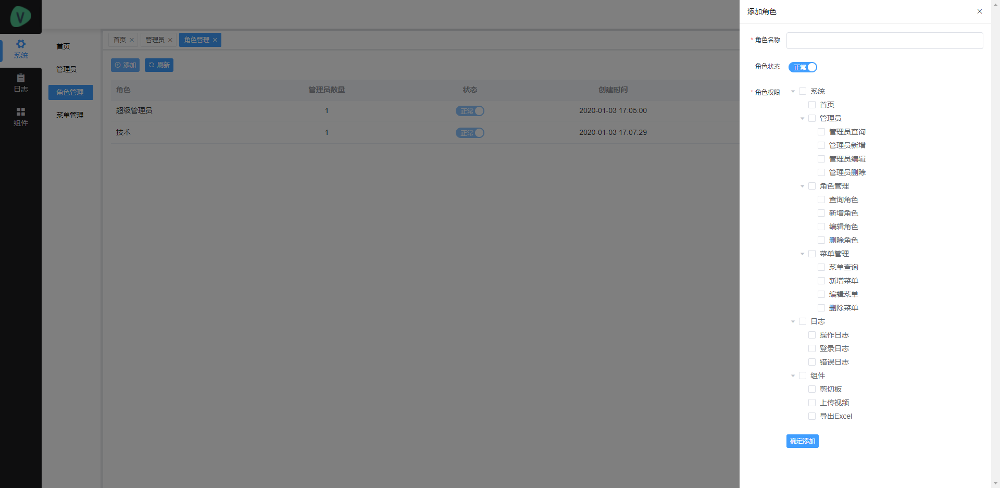

## SpringBoot-Admin 简称 spba
基于SpringBoot、Vue开发的通用后台管理系统，做到开箱即用，为新项目开发省去了基础功能开发的步骤。此系统主要包含：登录、注销、可视化数据大屏、管理员、角色管理、菜单管理、权限管理、错误日志、登录日志、操作日志、七牛云上传等功能。后端主要使用MySQL、MyBatis-Plus、Redis、Sa-Token权限认证框架、validation、七牛云、Elasticsearch等技术。拥有多线程配置类、定时任务、异步任务等示例。


## 项目截图





## 安装步骤
- git clone https://github.com/wdjisn/SpringBoot-Admin.git
- 使用maven引入依赖
- 将spba.sql文件导入数据库
- 修改application-dev.yml文件中mysql、redis配置项
- 获取客户端真实ip地址，需要配置nginx


## 前端代码仓库
- https://github.com/wdjisn/SpringBoot-Vue.git


## 在线体验
- 网址：http://spba.baobaonames.cn/#/login
- 账号：style
- 密码：admin123


## 疑问解答
- 微信：wdjisn


## 目录结构
```
├── SpbaApiApplication 项目启动类
|
├── config 配置类
|
├── controller 控制器
|
|── dao 数据访问层
|
├── domain 实体类
│   ├── dto 数据传输对象
│   ├── entity 数据表实体类
│   ├── es Elasticsearch实体类
|
├── exception 异常处理
|
├── interceptor 拦截器
|
├── service 服务接口层
│   ├── impl 服务接口实现层
|
├── utils 工具类
|
├── resources
|   ├── mapper SQL对应的XML文件
```


## 编程规范
```
规范不是为了约束和禁锢大家的创造力，而是为了在团队实际开发过程中，提高项目的开发效率。以下规范，仅供参考。

1.路由规范
• 推荐使用restful命名， 规范如下：
• GET       /admins        获取管理员列表
• GET       /admin/{id}    获取管理员详情
• POST      /admin         新增管理员
• PUT       /admin         编辑管理员
• DELETE    /admin/{id}    删除管理员

2.controller层规范
• 不做任何的业务逻辑操作
• 负责协同和委派业务，充当路由的角色，每个方法要保持简洁
• 不做任何的参数、业务校验，参数校验只允许使用@Valid 注解做简单的校验
• 只允许在 method 上添加 RequestMapping 注解，不允许加在 class 上

3.service层规范
• 合理拆分 service 文件，如果业务较大，请拆分为多个 service。
• 谨慎处理 @Transactional 事务注解的使用，不要简单对 service 的方法添加个 @Transactional。应当合并对数据库的操作，尽量减少添加了@Transactional方法内的业务逻辑。

4.dao层规范
• 优先使用 Mybatis-plus 框架
• 所有 Dao 继承自 BaseMapper
• 禁止使用 Mybatis-plus 的 Wrapper 条件构建器
• 禁止直接在 Mybatis xml 中写死常量，应从 dao 中传入到 xml 中
• 建议不要使用星号 * 代替所有字段

5.dao层方法命名规范
• 获取单个对象的方法用 getInfo 做前缀
• 获取分页对象的方法用 getList 做前缀
• 获取所有对象的方法用 getAll 做前缀
• 获取统计值的方法用 getCount 做前缀
• 插入的方法用 save
• 修改的方法用 update
• 删除的方法用 delete
• 建议：dao层方法命名尽量以sql语义命名，避免与业务关联。命名与业务关联，局限了dao方法的使用场景和范围，降低了方法的复用性，造成他人困惑以及重复造轮子。
```